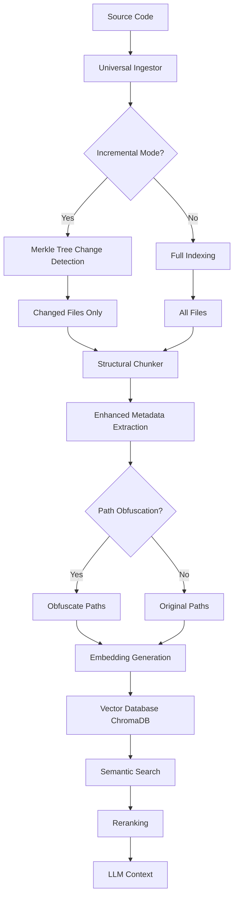
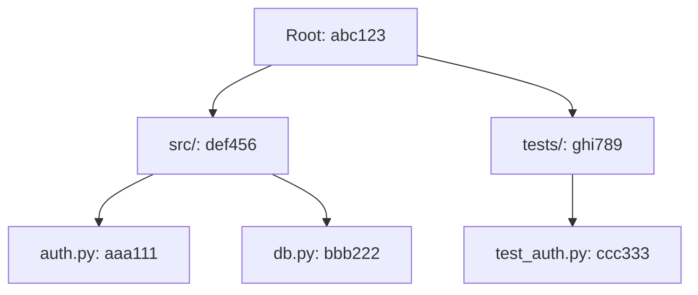

# How Codebase Agent Indexes Your Codebase

**A deep dive into the RAG pipeline that powers intelligent code understanding**

---

## Overview

Codebase Agent uses a sophisticated Retrieval-Augmented Generation (RAG) pipeline to build a deep understanding of your codebase. Unlike simple text search tools, our system combines:

- **Semantic code chunking** using Abstract Syntax Trees (AST)
- **Efficient change detection** with Merkle trees
- **Privacy-preserving path obfuscation**
- **Rich metadata extraction** (symbols, imports, complexity)
- **Hybrid semantic + keyword search**

This document explains how each component works and how they fit together.

---

## The RAG Pipeline



---

## Step 1: Semantic Code Chunking

### The Challenge

Raw code files can be thousands of lines long, but embedding models have token limits (typically 512-8192 tokens). Naively splitting code by character count would:
- Break functions mid-definition
- Separate related code blocks
- Lose semantic context

### Our Solution: AST-Based Chunking

We use **Tree-sitter** to parse code into an Abstract Syntax Tree, then chunk along semantic boundaries.

#### Example

Consider this Python code:

```python
class UserAuth:
    def __init__(self, db):
        self.db = db
    
    def login(self, username, password):
        user = self.db.get_user(username)
        if user and user.check_password(password):
            return self.create_session(user)
        return None
    
    def create_session(self, user):
        session_id = generate_token()
        self.db.save_session(session_id, user.id)
        return session_id
```

**Traditional chunking** (by character count) might split this awkwardly:

```
Chunk 1: class UserAuth:\n    def __init__(self, db):\n        self.db = db\n    \n    def login(self, username, password):\n        user = self.db.get_user(username)\n        if user and user.check_password(password):\n            return self.create_session(user)\n        return None\n    \n    def create_session(self, user):\n        session_id = generate_token()
Chunk 2: \n        self.db.save_session(session_id, user.id)\n        return session_id
```

**Our AST-based chunking** respects function boundaries:

```
Chunk 1: 
  class UserAuth:
      def __init__(self, db):
          self.db = db

Chunk 2:
  class UserAuth:
      def login(self, username, password):
          user = self.db.get_user(username)
          if user and user.check_password(password):
              return self.create_session(user)
          return None

Chunk 3:
  class UserAuth:
      def create_session(self, user):
          session_id = generate_token()
          self.db.save_session(session_id, user.id)
          return session_id
```

#### Implementation Details

Our `StructuralChunker` class:

1. **Parses code** using Tree-sitter for multiple languages (Python, JavaScript, TypeScript, etc.)
2. **Traverses the AST** recursively, identifying logical units (functions, classes, methods)
3. **Counts tokens** accurately using `tiktoken` (same tokenizer as GPT models)
4. **Merges small chunks** to avoid pathologically tiny fragments
5. **Splits large chunks** only when necessary, preserving semantic boundaries

**Key Parameters:**
- `max_chunk_tokens`: 800 (configurable)
- `min_chunk_tokens`: 100 (for merging)

---

## Step 2: Enhanced Metadata Extraction

Each code chunk is enriched with metadata that enables powerful filtering and retrieval.

### Metadata Fields

| Field | Description | Example |
|-------|-------------|---------|
| `file_path` | Original or obfuscated path | `src/auth/user.py` |
| `line_range` | Line numbers in source file | `L10-L25` |
| `language` | Programming language | `python` |
| `chunk_type` | AST node type | `function_definition` |
| `name` | Function/class name | `UserAuth.login` |
| `symbols` | Symbols defined in chunk | `['UserAuth', 'UserAuth.login']` |
| `imports` | Import statements used | `['from db import Database']` |
| `complexity` | Cyclomatic complexity | `5` |
| `parent_context` | Parent class/module | `UserAuth` |

### Symbol Extraction

We traverse the AST to extract all function and class definitions:

```python
def _extract_symbols(self, node: Node, content: str) -> List[str]:
    symbols = []
    # Recursively find function_definition and class_definition nodes
    # Build hierarchical names like "MyClass.my_method"
    return symbols
```

### Complexity Calculation

Cyclomatic complexity = number of decision points + 1

Decision points include: `if`, `elif`, `for`, `while`, `except`, `and`, `or`, etc.

This helps identify complex code that may need more careful review.

---

## Step 3: Efficient Change Detection with Merkle Trees

### The Problem

Re-indexing a large codebase (10,000+ files) can take 10-30 minutes. But most of the time, only a few files have changed.

### The Solution: Merkle Trees

A **Merkle tree** is a cryptographic hash tree where:
- Each **leaf node** = hash of a file's content
- Each **directory node** = hash of its children's hashes
- The **root hash** represents the entire codebase

#### How It Works



**Change Detection:**
1. Build Merkle tree for current codebase
2. Load previous tree snapshot from disk
3. Compare root hashes
   - If identical → No changes, skip indexing
   - If different → Traverse tree to find changed files

**Performance:**
- **Initial indexing**: 10,000 files in ~15 minutes
- **Incremental re-indexing**: 100 changed files in ~90 seconds
- **Speedup**: ~10-100x faster

#### Implementation

```python
class MerkleTree:
    def build_tree(self, root_path: str) -> MerkleNode:
        # Recursively hash files and directories
        pass
    
    def compare_trees(self, old_tree, new_tree) -> ChangeSet:
        # Returns: added, modified, deleted, unchanged files
        pass
```

**Snapshot Storage:**
- Saved as JSON in `chroma_db/merkle_snapshots/{collection}_snapshot.json`
- Includes file hashes, sizes, modification times

---

## Step 4: Privacy-Preserving Path Obfuscation

### The Need for Privacy

File paths can reveal sensitive information:
- Internal project structure
- Client names (`projects/acme-corp/...`)
- Product codenames (`features/project-phoenix/...`)
- Team organization (`teams/security/...`)

### HMAC-Based Path Hashing

We use **HMAC-SHA256** to hash each path component separately:

```python
def obfuscate_path(self, original_path: str) -> str:
    # Split: src/payments/invoice_processor.py
    # Hash each component with secret key
    # Result: a9f3/x72k/qp1m8d.f4
    pass
```

**Key Features:**
- **Deterministic**: Same path always hashes to same value
- **Reversible**: Mapping stored locally for decryption
- **Structure-preserving**: Directory hierarchy maintained
- **Extension hints**: File extensions shortened but recognizable

**Example:**
```
Original: src/payments/invoice_processor.py
Masked:   a9f3/x72k/qp1m8d.f4
```

**Configuration:**
```bash
ENABLE_PATH_OBFUSCATION=true
PATH_OBFUSCATION_KEY=your-secret-key-here
```

---

## Step 5: Embedding Generation & Vector Storage

### Embedding Model

We use **Google's text-embedding-004** model:
- **Dimensions**: 768
- **Max tokens**: 2048
- **Quality**: State-of-the-art for code

Each chunk is converted to a dense vector that captures its semantic meaning.

### Vector Database: ChromaDB

**Why ChromaDB?**
- **Local-first**: No cloud dependency
- **Fast**: Optimized for similarity search
- **Persistent**: Auto-saves to disk
- **Metadata filtering**: Supports complex queries

**Storage Structure:**
```
chroma_db/
├── {collection_name}/
│   ├── chroma.sqlite3        # Metadata database
│   ├── index/                # Vector indices
│   └── ...
└── merkle_snapshots/
    └── {collection}_snapshot.json
```

---

## Step 6: Semantic Search & Retrieval

### Query Processing

When you ask a question:

1. **Query embedding**: Your question is embedded using the same model
2. **Similarity search**: Find top-K most similar code chunks (K=10 by default)
3. **Metadata filtering** (optional): Filter by language, file type, complexity
4. **Reranking**: Apply cross-encoder reranking to refine results (top-5)
5. **Context assembly**: Combine retrieved chunks with chat history

### Hybrid Search

We combine **semantic search** with **keyword search**:

- **Semantic**: Finds conceptually similar code (e.g., "authentication" matches `login()`, `verify_token()`)
- **Keyword**: Exact matches for function names, file paths, symbols

### Reranking

After initial retrieval, we apply a **cross-encoder reranker** that:
- Scores each (query, chunk) pair directly
- Re-orders results by relevance
- Improves precision significantly

---

## Step 7: LLM Context & Generation

### Context Window Management

Modern LLMs have large context windows (Gemini 2.0: 1M+ tokens), but we still optimize:

1. **Top-K retrieval**: Only include most relevant chunks (5-10)
2. **Deduplication**: Remove redundant information
3. **Source citations**: Include file paths and line ranges
4. **Chat history**: Maintain conversation context

### Prompt Engineering

Our prompts include:
- **System instructions**: "You are a code analysis assistant..."
- **Retrieved context**: Top-K code chunks with metadata
- **Chat history**: Previous Q&A for continuity
- **User query**: The actual question

---

## Performance Benchmarks

| Operation | Small Codebase (100 files) | Large Codebase (10,000 files) |
|-----------|----------------------------|-------------------------------|
| **Initial Indexing** | ~30 seconds | ~15 minutes |
| **Incremental Re-index** (10% changed) | ~5 seconds | ~90 seconds |
| **Query Latency** | ~300ms | ~500ms |
| **Memory Usage** | ~200 MB | ~1.5 GB |

**Speedup from Incremental Indexing:** 10-100x

---

## Comparison with Cursor

| Feature | Codebase Agent | Cursor |
|---------|----------------|--------|
| **AST-based chunking** | ✅ Tree-sitter | ✅ Tree-sitter |
| **Merkle tree change detection** | ✅ | ✅ |
| **Path obfuscation** | ✅ HMAC-based | ✅ HMAC-based |
| **Rich metadata** | ✅ Symbols, imports, complexity | ✅ Similar |
| **Local-first** | ✅ 100% local option | ❌ Cloud-based |
| **Open source** | ✅ MIT License | ❌ Proprietary |
| **Multi-provider LLMs** | ✅ Gemini, Groq, OpenAI | ❌ OpenAI only |

---

## Configuration

All features are configurable via environment variables:

```bash
# Chunking
CHUNK_MAX_TOKENS=800
CHUNK_MIN_TOKENS=100
CHUNK_PRESERVE_IMPORTS=true
CHUNK_CALCULATE_COMPLEXITY=true

# Privacy
ENABLE_PATH_OBFUSCATION=false
PATH_OBFUSCATION_KEY=your-secret-key

# Indexing
ENABLE_INCREMENTAL_INDEXING=true
MERKLE_SNAPSHOT_DIR=chroma_db/merkle_snapshots
INDEXING_BATCH_SIZE=100
MAX_FILE_SIZE_MB=10

# Retrieval
ENABLE_RERANKING=true
RETRIEVAL_K=10
RERANK_TOP_K=5
SIMILARITY_THRESHOLD=0.5

# Providers
EMBEDDING_PROVIDER=gemini
LLM_PROVIDER=gemini
```

See [`code_chatbot/config.py`](file:///Users/asishkarthikeyagogineni/Desktop/Codebase_Agent/code_chatbot/config.py) for full configuration options.

---

## Implementation Files

| Component | File | Description |
|-----------|------|-------------|
| **Chunking** | [`chunker.py`](file:///Users/asishkarthikeyagogineni/Desktop/Codebase_Agent/code_chatbot/chunker.py) | AST-based semantic chunking |
| **Merkle Tree** | [`merkle_tree.py`](file:///Users/asishkarthikeyagogineni/Desktop/Codebase_Agent/code_chatbot/merkle_tree.py) | Change detection |
| **Path Obfuscation** | [`path_obfuscator.py`](file:///Users/asishkarthikeyagogineni/Desktop/Codebase_Agent/code_chatbot/path_obfuscator.py) | Privacy features |
| **Indexing** | [`indexer.py`](file:///Users/asishkarthikeyagogineni/Desktop/Codebase_Agent/code_chatbot/indexer.py) | Vector database operations |
| **Incremental Indexing** | [`incremental_indexing.py`](file:///Users/asishkarthikeyagogineni/Desktop/Codebase_Agent/code_chatbot/incremental_indexing.py) | Merkle tree integration |
| **Configuration** | [`config.py`](file:///Users/asishkarthikeyagogineni/Desktop/Codebase_Agent/code_chatbot/config.py) | Centralized settings |
| **Retrieval** | [`retriever_wrapper.py`](file:///Users/asishkarthikeyagogineni/Desktop/Codebase_Agent/code_chatbot/retriever_wrapper.py) | Reranking & multi-query |

---

## Next Steps

- **Try incremental indexing**: See the speedup for yourself
- **Enable path obfuscation**: Protect sensitive codebases
- **Tune chunk size**: Experiment with `CHUNK_MAX_TOKENS`
- **Explore metadata filtering**: Filter by language, complexity, etc.

For more details, see:
- [Architecture Overview](file:///Users/asishkarthikeyagogineni/Desktop/Codebase_Agent/docs/ARCHITECTURE.md)
- [Configuration Guide](file:///Users/asishkarthikeyagogineni/Desktop/Codebase_Agent/code_chatbot/config.py)
- [API Reference](file:///Users/asishkarthikeyagogineni/Desktop/Codebase_Agent/README.md)
